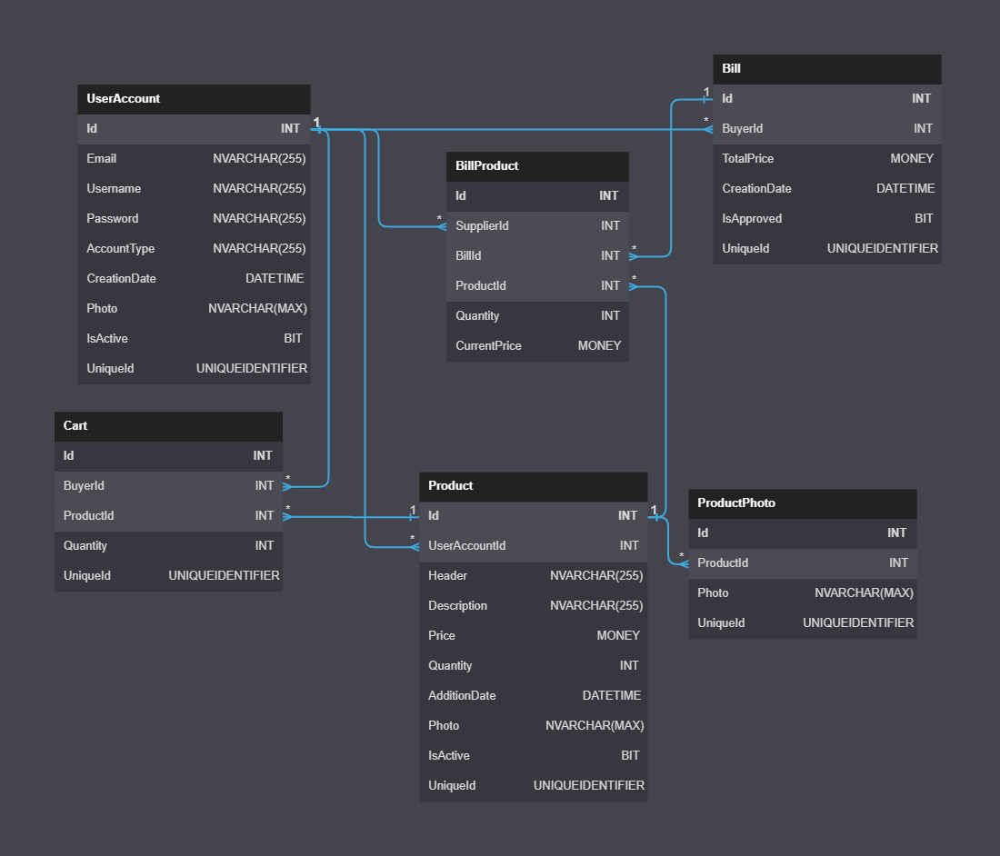

# DeliveryChainManagement
 ITG - DeliveryChainManagement by [CRYALP.com](https://cryalp.com/).
 
## Auto Running
```
Just use the "auto.bat" file
```


 
## Manual Running
### Maven Clean And Package
```
cd ./Java
call mvn clean package
```

### SSL Cert Creation
```
keytool -genkey -alias springboot -storetype PKCS12 -keyalg RSA -keysize 2048 -keystore keystore.pfx -validity 3650 -storepass password -dname "CN=cryalp.com, OU=CRY, O=CRY, L=Yalova, ST=Turkey, C=TR"
```

### Java Run Package
```
java -jar ./target/DeliveryChain-1.1.0.RELEASE.war
```